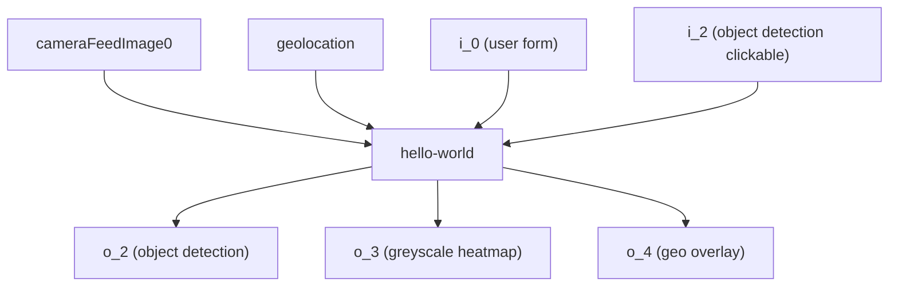

# hello-world

This plug-in serves as an example of how to create a plug-in for the CGC. It is a simple plug-in that outputs a box with a label and a heatmap overlay of the input image.

## Build

```
docker build -t hello-world -f Dockerfile .
```

## Run

Make a working directory to store all files generated by the plug-in and test harness.

```
./test-harness/start-test.sh hello-world:latest <absolute path to working directory> hello-world/test-request.json

# example
./test-harness/start-test.sh hello-world:latest $(pwd)/working cgc-plug-in/hello-world/test-request.json
```

## Tutorial

For a step-by-step tutorial on how to create a plug-in, please see the [CGC Plug-in Developer Guide](https://wiki.advancednavigation.com/pages/viewpage.action?pageId=169312287)

## Flowchart

The flowchart below shows the flow of data through the plug-in.

Hello world monitors input folders for new files. new file is detected, it is processed and the output is written to the output folders.


